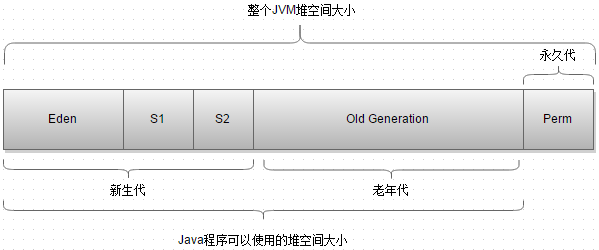
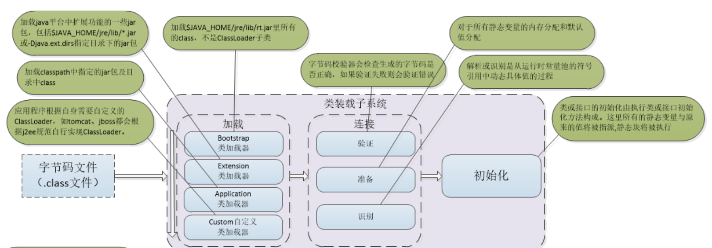
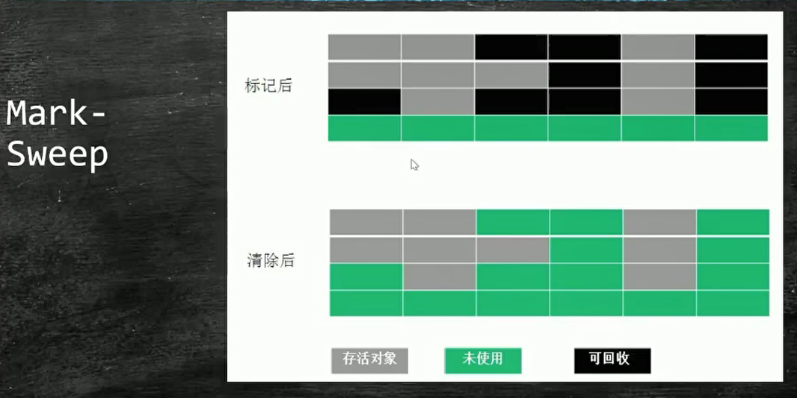
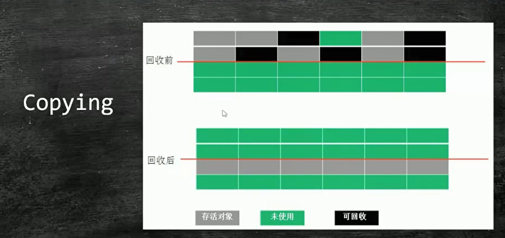
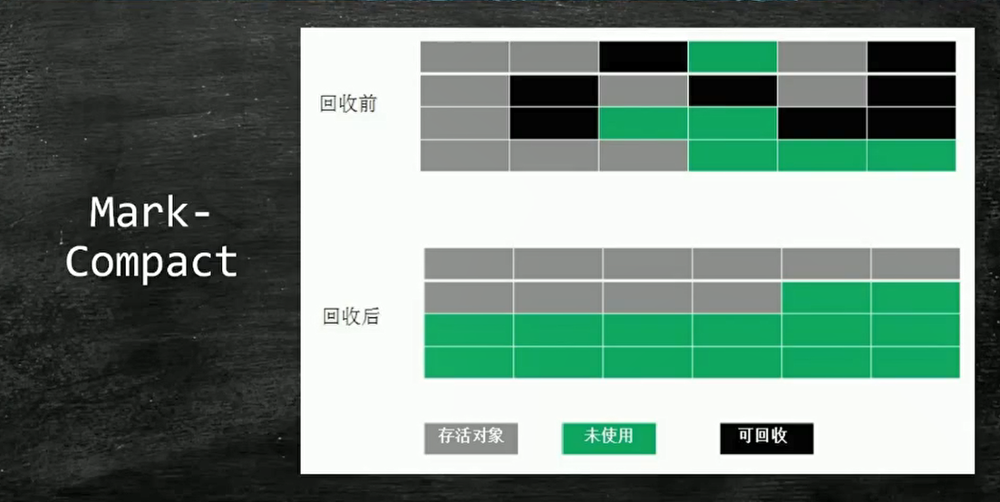
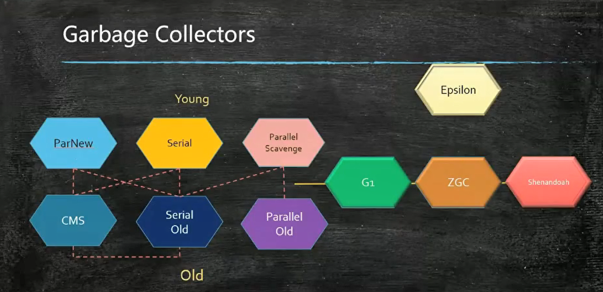
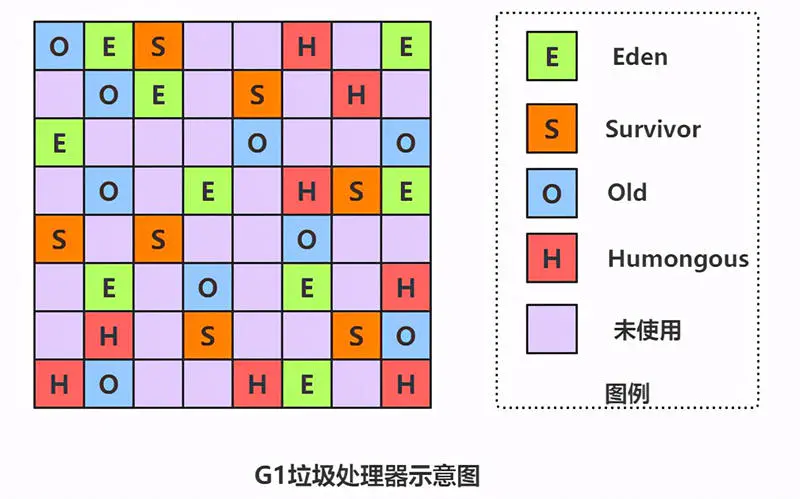
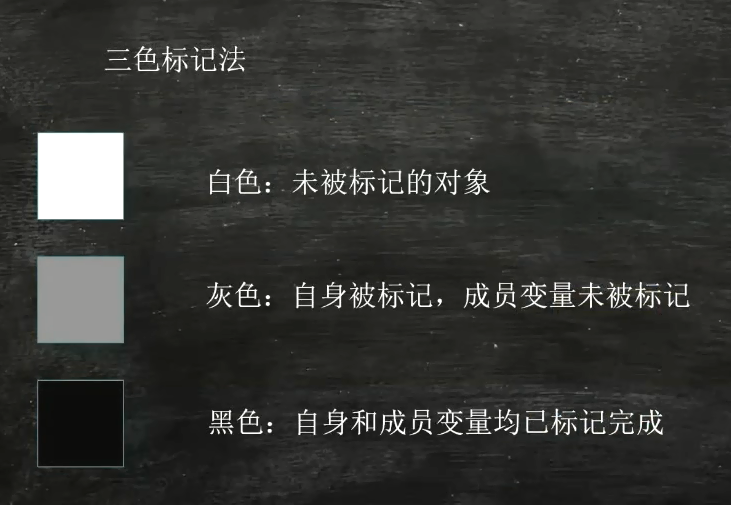
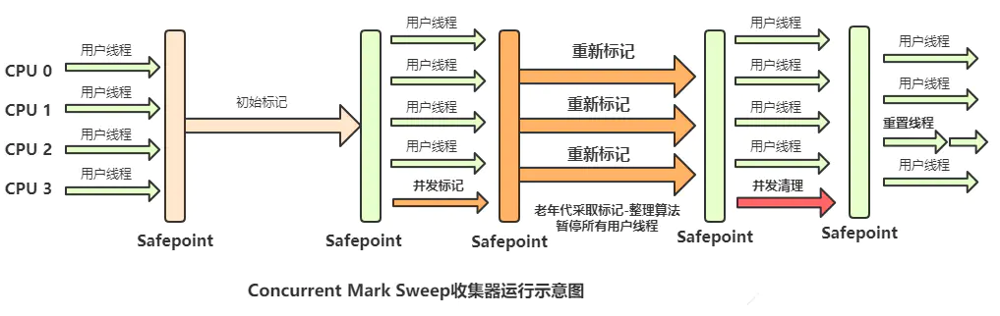
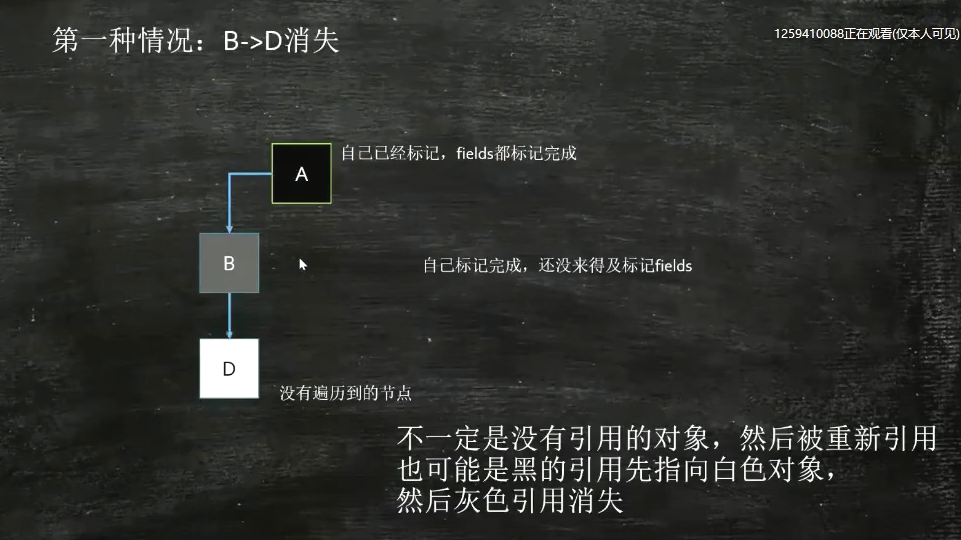

## JDK、JRE和JVM是什么关系（JDK包含JRE，而JRE包含JVM）

JDK:JDK(Java Development Kit) 是整个JAVA的核心，包括了Java运行环境（Java Runtime Envirnment），一堆Java工具（javac/java/jdb等）和Java基础的类库（即Java API 包括rt.jar）。JDK是java开发工具包，基本上每个学java的人都会先在机器 上装一个JDK，那他都包含哪几部分呢？在目录下面有 六个文件夹、一个src类库源码压缩包、和其他几个声明文件。其中，真正在运行java时起作用的 是以下四个文件夹：bin、include、lib、 jre。有这样一个关系，JDK包含JRE，而JRE包 含JVM。

1. bin:最主要的是编译器(javac.exe)
2. include:java和JVM交互用的头文件
3. lib：类库
4. jre:java运行环境

JRE:JRE（Java Runtime Environment，Java运行环境），包含JVM标准实现及Java核心类库（jre里有运行.class的java.exe）。JRE是Java运行环境，并不是一个开发环境，所以没有包含任何开发工具（如编译器和调试器）

总的来说JDK是用于java程序的开发,而jre则是只能运行class而没有编译的功能

JVM:即java虚拟机, java运行时的环境。针对java用户，也就是拥有可运行的.class文件包（jar或者war）的用户。里面主要包含了jvm和java运行时基本类库（rt.jar）。rt.jar可以简单粗暴地理解为：它就是java源码编译成的jar包。Java虚拟机在执行字节码时，把字节码解释成具体平台上的机器指令执行。这就是Java的能够“一次编译，到处运行”的原因。

## JVM内存结构

### 程序计数器：

程序计数器是一块较小的内存空间，可以看作是当前线程所执行的字节码的行号指示器。字节码解释器工作时通过改变这个计数器的值来选取下一条需要执行的字节码指令，分支、循环、跳转、异常处理、线程恢复等功能都需要依赖这个计数器来完。

java虚拟机的多线程是通过线程轮流切换并分配CPU的时间片的方式实现的，因此在任何时刻一个处理器（如果是多核处理器，则只是一个核）都只会处理一个线程，为了线程切换后能恢复到正确的执行位置，每条线程都需要有一个独立的程序计数器，各线程之间计数器互不影响，独立存储，因此这类内存区域为“线程私有”的内存。

程序计数器主要有两个作用：

1. 字节码解释器通过改变程序计数器来依次读取指令，从而实现代码的流程控制，如：顺序执行、选择、循环、异常处理。

2. 在多线程的情况下，程序计数器用于记录当前线程执行的位置，从而当线程被切换回来的时候能够知道该线程上次运行到哪儿了。

### 虚拟机栈

Java虚拟机栈也是线程私有的，它的生命周期和线程相同，描述的是 Java 方法执行的内存模型。Java虚拟机栈是由一个个栈帧组成，线程在执行一个方法时，便会向栈中放入一个栈帧，每个栈帧中都拥有局部变量表、操作数栈、动态链接、方法出口信息。局部变量表主要存放了编译器可知的各种基本数据类型（boolean、byte、char、short、int、float、long、double）和对象引用（reference类型，它不同于对象本身，可能是一个指向对象起始地址的引用指针，也可能是指向一个代表对象的句柄或其他与此对象相关的位置）。

### 本地方法栈

本地方法栈和虚拟机栈所发挥的作用非常相似，区别是：虚拟机栈为虚拟机执行 Java 方法 （也就是字节码）服务，而本地方法栈则为虚拟机使用到的 Native 方法服务。 

本地方法被执行的时候，在本地方法栈也会创建一个栈帧，用于存放该本地方法的局部变量表、操作数栈、动态链接、出口信息。方法执行完毕后相应的栈帧也会出栈并释放内存空间

### 方法区：

方法区与 Java 堆一样，是各个线程共享的内存区域，它用于存储已被虚拟机加载的类信息、常量、静态变量、即时编译器编译后的代码等数据。虽然Java虚拟机规范把方法区描述为堆的一个逻辑部分，但是它却有一个别名叫做 Non-Heap（非堆），目的应该是与 Java 堆区分开来。

HotSpot 虚拟机中方法区也常被称为 “永久代”，本质上两者并不等价。仅仅是因为 HotSpot 虚拟机设计团队用永久代来实现方法区而已，这样 HotSpot 虚拟机的垃圾收集器就可以像管理 Java 堆一样管理这部分内存了。但是这并不是一个好主意，因为这样更容易遇到内存溢出问题。

相对而言，垃圾收集行为在这个区域是比较少出现的，但并非数据进入方法区后就“永久存在”了

### 堆：

堆是Java 虚拟机所管理的内存中最大的一块，Java 堆是所有线程共享的一块内存区域，在虚拟机启动时创建。此内存区域的唯一目的就是存放对象实例，几乎所有的对象实例以及数组都在这里分配内存

Java 堆是垃圾收集器管理的主要区域，因此也被称作GC堆（Garbage Collected Heap）。从垃圾回收的角度，由于现在收集器基本都采用分代垃圾收集算法，所以Java堆还可以细分为：新生代和老年代：其中新生代又分为：Eden（伊甸）空间、Survivor From 、Survivor To 空间。进一步划分的目的是更好地回收内存，或者更快地分配内存。“分代回收”是基于这样一个事实：对象的生命周期不同，所以针对不同生命周期的对象可以采取不同的回收方式，以便提高回收效率。从内存分配的角度来看，线程共享的java堆中可能会划分出多个线程私有的分配缓冲区（Thread Local Allocation Buffer，TLAB）。

　　如图所示，JVM内存主要由新生代、老年代、永久代构成。

① 新生代（Young Generation）：大多数对象在新生代中被创建，其中很多对象的生命周期很短。每次新生代的垃圾回收（又称Minor GC）后只有少量对象存活，所以选用复制算法，只需要少量的复制成本就可以完成回收。

新生代内又分三个区：一个Eden区，两个Survivor区（一般而言），大部分对象在Eden区中生成。当Eden区满时，还存活的对象将被复制到两个Survivor区（中的一个）。当这个Survivor区满时，此区的存活且不满足“晋升”条件的对象将被复制到另外一个Survivor区。对象每经历一次Minor GC，年龄加1，达到“晋升年龄阈值”后，被放到老年代，这个过程也称为“晋升”。显然，“晋升年龄阈值”的大小直接影响着对象在新生代中的停留时间，在Serial和ParNew GC两种回收器中，“晋升年龄阈值”通过参数MaxTenuringThreshold设定，默认值为15。

② 老年代（Old Generation）：在新生代中经历了N次垃圾回收后仍然存活的对象，就会被放到年老代，该区域中对象存活率高。老年代的垃圾回收（又称Major GC）通常使用“标记-清除”或“标记-整理”算法。整堆包括新生代和老年代的垃圾回收称为Full GC（HotSpot VM里，除了CMS之外，其它能收集老年代的GC都会同时收集整个GC堆，包括新生代）。

③ 永久代（Perm Generation）：主要存放元数据，例如Class、Method的元信息，与垃圾回收要回收的Java对象关系不大。相对于新生代和年老代来说，该区域的划分对垃圾回收影响比较小。

在 JDK 1.8中移除整个永久代，取而代之的是一个叫元空间（Metaspace）的区域（永久代使用的是JVM的堆内存空间，而元空间使用的是物理内存，直接受到本机的物理内存限制）。

## 类加载顺序

## 为什么要调优

1. 是因为早期垃圾回收器GC的时候STW会造成JVM卡顿，如果JVM运行时间长那么卡顿时间会非常长。不利于高性能所以需要JVMGC调优。

## 什么叫垃圾

1. 没有引用指向的对象就叫垃圾

## 如何解决线上GC频繁的问题？

1. 查看监控（无日志不调优，项目上线要默认启动GC日志），以了解出现问题的时间点以及当前FGC的频率（可对比正常情况看频率是否正常）
2. 了解该时间点之前有没有程序上线、基础组件升级等情况。
3. 了解JVM的参数设置，包括：堆空间各个区域的大小设置，新生代和老年代分别采用了哪些垃圾收集器，然后分析JVM参数设置是否合理。最大堆最小堆要设置为一致，防止内存动荡。serial old单线程所以加大内存反而GC变慢。使用CMS算法加大内存升级硬件，反而使得STW变长，是因为CMS采用标记清除会产生碎片，然后使用serial old 去压缩碎片，serial old是单线程的所以会变慢。
4. 再对步骤1中列出的可能原因做排除法，其中元空间被打满、内存泄漏、代码显式调用gc方法比较容易排查。
5. 针对大对象或者长生命周期对象导致的FGC，可通过 jmap -histo 命令并结合dump堆内存文件作进一步分析，需要先定位到可疑对象。因为jmap -histo会立即导致STW所以一般不使用，而使用阿尔萨斯（Arthas）进行分析。
6. 通过可疑对象定位到具体代码再次分析，这时候要结合GC原理和JVM参数设置，弄清楚可疑对象是否满足了进入到老年代的条件才能下结论。

##  简述一下内存溢出的原因，如何排查线上问题？

内存溢出：一直往内存里放东西，内存满了还放就溢出了。

内存泄漏：有一块内存不知道被放了什么东西，而且永远不会用，少了一块内存用。

**内存溢出的原因：**

1. java.lang.OutOfMemoryError: ......java heap space..... 堆栈溢出，代码问题的可能性极大
2. java.lang.OutOfMemoryError: GC over head limit exceeded 系统处于高频的GC状态，而且回收的效果依然不佳的情况，就会开始报这个错误，这种情况一般是产生了很多不可以被释放的对象，有可能是引用使用不当导致，或申请大对象导致，但是java heap space的内存溢出有可能提前不会报这个错误，也就是可能内存就直接不够导致，而不是高频GC。
3. java.lang.OutOfMemoryError: PermGen space jdk1.7之前才会出现的问题 ，原因是系统的代码非常多或引用的第三方包非常多、或代码中使用了大量的常量、或通过intern注入常量、或者通过动态代码加载等方法，导致常量池的膨胀。
4. java.lang.OutOfMemoryError: Direct buffer memory 直接内存不足，因为jvm垃圾回收不会回收掉直接内存这部分的内存，所以可能原因是直接或间接使用了ByteBuffer中的allocateDirect方法的时候，而没有做clear。
5. java.lang.StackOverflowError - Xss设置的太小了。
6. java.lang.OutOfMemoryError: unable to create new native thread 堆外内存不足，无法为线程分配内存区域。
7. java.lang.OutOfMemoryError: request {} byte for {}out of swap 地址空间不够。

## 垃圾回收的算法

### 基本算法

#### Mark-Sweep（标记清除）

1. 
2. 优点：算法相对简单，存活对象比较多的情况下效率较高。
3. 缺点：两遍扫描，效率偏低，容易产生碎片。

#### Copying（拷贝）

1. 
2. 缺点：有一半空间用不上。

#### Mark-Compact（标记压缩）

1. 
2. 原理：先进行垃圾回收，清除指定内存区域的垃圾然后把零散的整理放到一块去。
3. 优点：不会产生碎片，方便对象分配，不会产生内存减半。
4. 缺点：扫描两次，需要移动对象，效率偏低效率太慢。

### 常用算法

1. 

新生代收集器（全部都是复制算法）：ParNew、Serial、Parallel Scavenge。

老年代收集器：CMS（标记清除）、Serial Old（标记整理）、Parallel Old（标记整理）

整堆收集器：G1（一个Region中是标记清除，2个Region之间是复制算法）

并行（Parallel）：多个垃圾收集线程并行工作，此时用户线程处于等待状态。

并发（Concurrent）：用户线程和垃圾收集线程同时执行。

吞吐量：运行用户代码时间／（运行用户代码时间＋垃圾回收时间）。

吞吐量优先：Parallel Scavenge+Parallel Old（多线程并行）

响应时间优先：cms+par new（并发回收垃圾）

#### ParNew、CMS配套使用

1. **ParNew**

   1. 新生代
   2. 主要与CMS配套使用

2. **CMS**

   1. 老年代
   2. 并发执行

   CMS(Concurrent Mark Sweep)收集器是一种以获取最短回收停顿时间为目标的收集器。目前很大一部分的Java应用集中在互联网网站或者基于浏览器的B/S系统的服务端上，这类应用通常都会较为关注服务的响应速度，希望系统停顿时间尽可能短，以给用户带来良好的交互体验。CMS收集器就非常符合这类应用的需求(但是实际由于某些问题,很少有使用CMS作为主要垃圾回收器的)。

   ​	CMS是基于“标记-清除”算法实现的，整个过程分为4个步骤：

   1. 初始标记（CMS initial mark）。
   2. 并发标记（CMS concurrent mark）。
   3. 重新标记（CMS remark）。
   4. 并发清除（CMS concurrent sweep）。

   注意：“标记”是指将存活的对象和要回收的对象都给标记出来，而“清除”是指清除掉将要回收的对象。

   其中初始标记、重新标记这两个步骤仍然需要“Stop The World”。初始标记仅仅只是标记一下GCRoots能直接关联到的对象，速度很快；

   并发标记阶段就是从GC Roots的直接关联对象开始遍历整个对象图的过程，这个过程耗时较长但是不需要停顿用户线程，可以与垃圾收集线程一起并发运行；

   重新标记阶段则是为了修正并发标记期间，因用户程序继续运作而导致标记产生变动的那一部分对象的标记记录，这个阶段的停顿时间通常会比初始标记阶段稍长一些，但也远比并发标记阶段的时间短；

   最后是并发清除阶段，清理删除掉标记阶段判断的已经死亡的对象，由于不需要移动存活对象，所以这个阶段也是可以与用户线程同时并发的。由于在整个过程中耗时最长的并发标记和并发清除阶段中，垃圾收集器线程都可以与用户线程一起工作，所以从总体上来说，CMS收集器的内存回收过程是与用户线程一起并发执行的。

   **CMS解决办法:增量更新**

   在应对漏标问题时，CMS使用了增量更新(Increment Update)方法来做：

   在一个未被标记的对象（白色对象）被重新引用后，**引用它的对象若为黑色则要变成灰色，在下次二次标记时让GC线程继续标记它的属性对象**。

   但是就算时这样，其仍然是存在漏标的问题：

   在一个灰色对象正在被一个GC线程回收时，当它已经被标记过的属性指向了一个白色对象（垃圾）

   而这个对象的属性对象本身还未全部标记结束，则为灰色不变

   **而这个GC线程在标记完最后一个属性后，认为已经将所有的属性标记结束了，将这个灰色对象标记为黑色，被重新引用的白色对象，无法被标记**

   

   **CMS另两个致命缺陷**

   ​		CMS采用了Mark-Sweep算法，最后会产生许多内存碎片，当到一定数量时，CMS无法清理这些碎片了，CMS会让Serial Old垃圾处理器来清理这些垃圾碎片，而Serial Old垃圾处理器是单线程操作进行清理垃圾的，效率很低。所以使用CMS就会出现一种情况，硬件升级了，却越来越卡顿，其原因就是因为进行Serial Old GC时，效率过低。解决方案：使用Mark-Sweep-Compact算法，减少垃圾碎片调优参数（配套使用）：-XX:+UseCMSCompactAtFullCollection 开启CMS的压缩 -XX:CMSFullGCsBeforeCompaction 默认为0，指经过多少次CMS FullGC才进行压缩

   当JVM认为内存不够，再使用CMS进行并发清理内存可能会发生OOM的问题，而不得不进行Serial Old GC，Serial Old是单线程垃圾回收，效率低解决方案：降低触发CMS GC的阈值，让浮动垃圾不那么容易占满老年代调优参数：-XX:CMSInitiatingOccupancyFraction 92% 可以降低这个值，让老年代占用率达到该值就进行CMS GC

   

   **CMS并不会full GC，而其他种类的都是full GC**。

#### Serial、Serial Old配套使用

1. Serial
   1. a stop-the-world,copying collector which uses a single GC thread
   2. 新生代
   3. 单线程
   4. 单CPU效率最高，虚拟机是Client模式的默认垃圾回收器。
   
2. SerialOld
   1. 老年代
   2. 单线程

#### Parallel Scavenge、Parallel Old配套使用（JDK1.8默认使用）

1. Parallel Scavenge
   1. a stop-the world,copying collector which uses multiple GC threads
   2. 新生代
   3. Serial的进阶版本，多线程。

2. Parallel Old
   1. 老年代
   2. Serial Old的进阶版本，多线程。

#### G1（逻辑分代，物理分区）

G1也是会短暂停顿的，虽然非常非常细微。

G1(Garbage First)物理内存不再分代，而是由一块一块的Region组成,但是逻辑分代仍然存在。G1不再坚持固定大小以及固定数量的分代区域划分，而是把连续的Java堆划分为多个大小相等的独立区域（Region），每一个Region都可以根据需要，扮演新生代的Eden空间、Survivor空间，或者老年代空间。收集器能够对扮演不同角色的Region采用不同的策略去处理，这样无论是新创建的对象还是已经存活了一段时间、熬过多次收集的旧对象都能获取很好的收集效果。

Region中还有一类特殊的Humongous区域，专门用来存储大对象。G1认为只要大小超过了一个Region容量一半的对象即可判定为大对象。每个Region的大小可以通过参数-XX：G1HeapRegionSize设定，取值范围为1MB～32MB，且应为2的N次幂。而对于那些超过了整个Region容量的超级大对象，将会被存放在N个连续的Humongous Region之中，G1的大多数行为都把Humongous Region作为老年代的一部分来进行看待，如图所示

#### ZGC

ZGC 全称 Z Garbage Collector，是一款在 JDK11 新加入的具有实验性质的低延迟垃圾收集器，由 Oracle 公司研发。ZGC 与 Shenandoah 的目标高度相似，都希望在对吞吐量影响不大的前提下，实现任意堆内存大小下垃圾收集停顿时间限制在十毫秒以内，但两者的实现思路又有显著差异。ZGC 是一款基于 Region 内存布局的，不设分代的，使用读屏障、染色指针和内存多重映射等技术来实现可并发的标记 - 整理算法的，以低延迟为首要目标的一款垃圾收集器

#### Shenandoah

Shenandoah 作为一款第一个不由 Oracle 开发的 HotSpot 收集器，被官方明确拒绝在 OracleJDK12 中支持 Shenandoah 收集器，因此 Shenandoah 收集器只在 OpenJDK 才会包含。Shenandoah 收集器能实现在任何堆内存大小下都把垃圾停顿时间限制在十毫秒以内，这意味着相比 CMS 和 G1，Shenandoah 不仅要进行并发的垃圾标记，还要并发低进行对象清理后的整理

目标与ZGL一样，但因为不被Oracle接受，所以比较小众，而且能被ZGL代替。

#### Epsilon

1. 不干任何事的垃圾回收器，不执行任何垃圾回收工作。一旦java的堆被耗尽，jvm就直接关闭。设计的目的是提供一个完全消极的GC实现，分配有限的内存分配，最大限度降低消费内存占用量和内存吞吐时的延迟时间。一个好的实现是隔离代码变化，不影响其他GC，最小限度的改变其他的JVM代码。
2. 什么都不执行的GC非常适合用于差异性分析。no-op GC可以用于过滤掉GC诱发的新能损耗，比如GC线程的调度，GC屏障的消耗，GC周期的不合适触发，内存位置变化等。此外有些延迟者不是由于GC引起的，比如scheduling hiccups, compiler transition hiccups，所以去除GC引发的延迟有助于统计这些延迟。

### 三色标记算法

​		三色标记法是一种垃圾回收法，它可以让JVM不发生或仅短时间发生STW(Stop The World)，从而达到清除JVM内存垃圾的目的。JVM中的**CMS、G1垃圾回收器**所使用垃圾回。

#### 三色标记算法思想

三色标记法将对象的颜色分为了黑、灰、白，三种颜色。

**白色**：该对象没有被标记过。（对象垃圾）

**灰色**：该对象已经被标记过了，但该对象下的属性没有全被标记完。（GC需要从此对象中去寻找垃圾）

**黑色**：该对象已经被标记过了，且该对象下的属性也全部都被标记过了。（程序所需要的对象）

#### 算法流程

​		从我们main方法的根对象（JVM中称为GC Root）开始沿着他们的对象向下查找，用黑灰白的规则，标记出所有跟GC Root相连接的对象,扫描一遍结束后，一般需要进行一次短暂的STW(Stop The World)，再次进行扫描，此时因为黑色对象的属性都也已经被标记过了，所以只需找出灰色对象并顺着继续往下标记（且因为大部分的标记工作已经在第一次并发的时候发生了，所以灰色对象数量会很少，标记时间也会短很多）, 此时程序继续执行，GC线程扫描所有的内存，找出扫描之后依旧被标记为白色的对象（垃圾）,清除。

#### 具体流程:

1. 首先创建三个集合：白、灰、黑。

2. 将所有对象放入白色集合中。

3. 然后从根节点开始遍历所有对象（注意这里并不**递归遍历**），把遍历到的对象从白色集合放入灰色集合。
4. 之后遍历灰色集合，将灰色对象引用的对象从白色集合放入灰色集合，之后将此灰色对象放入黑色集合
5. 重复 4 直到灰色中无任何对象
6. 通过write-barrier检测对象有变化，重复以上操作
7. 收集所有白色对象（垃圾）

#### 三色标记存在问题

1. 浮动垃圾：并发标记的过程中，若一个已经被标记成黑色或者灰色的对象，突然变成了垃圾，由于不会再对黑色标记过的对象重新扫描,所以不会被发现，那么这个对象不是白色的但是不会被清除，重新标记也不能从GC Root中去找到，所以成为了浮动垃圾，**浮动垃圾对系统的影响不大，留给下一次GC进行处理即可**。

2. 对象漏标问题（需要的对象被回收）：并发标记的过程中，一个业务线程将一个未被扫描过的白色对象断开引用成为垃圾（删除引用），同时黑色对象引用了该对象（增加引用）（这两部可以不分先后顺序）；因为黑色对象的含义为其属性都已经被标记过了，重新标记也不会从黑色对象中去找，导致该对象被程序所需要，却又要被GC回收，此问题会导致系统出现问题，而CMS与G1，两种回收器在使用三色标记法时，都采取了一些措施来应对这些问题，**CMS对增加引用环节进行处理（Increment Update），G1则对删除引用环节进行处理(SATB)。**

#### 产生的问题

1. 

## 什么叫做阻塞队列的有界和无界，实际中有用过吗？

在并发编程中，有时候需要使用线程安全的队列。如果要实现一个线程安全的队列有两种方式：一种是使用阻塞算法，另一种是使用非阻塞算法。

使用阻塞算法的队列可以用一个锁（入队和出队用同一把锁）或两个锁（入队和出队用不同的锁）等方式来实现。非阻塞的实现方式则可以使用自旋+CAS的方式来实现。

既然用锁或 synchronized 关键字可以实现原子操作，那么为什么还要用 CAS 呢，因为加锁或使用 synchronized 关键字带来的性能损耗较大，而用 CAS 可以实现乐观锁，它实际上是直接利用了 CPU 层面的指令，所以性能很高。CAS 是实现自旋锁的基础，CAS 利用 CPU 指令保证了操作的原子性，以达到锁的效果，至于自旋呢，看字面意思也很明白，自己旋转，翻译成人话就是循环，一般是用一个无限循环实现。这样一来，一个无限循环中，执行一个 CAS 操作，当操作成功，返回 true 时，循环结束；当返回 false 时，接着执行循环，继续尝试 CAS 操作，直到返回 true。

ArrayBlockingQueue和LinkedBlockingQueue最大的区别是LinkedBlockingQueue有两把锁（take锁，put锁）所以并发性能高。但前者能用CPU缓存行而后者没有。

**阻塞队列：**

1. ArrayBlockingQueue：一个由数组结构组成的有界阻塞队列，线程池，生产者消费者。
2. LinkedBlockingQueue：一个由链表结构组成的无界阻塞队列，线程池，生产者消费者。
3. PriorityBlockingQueue：一个支持优先级排序的无界阻塞队列，可以实现精确的定时任务。
4. DelayQueue：一个使用优先级队列实现的无界阻塞队列，可以实现精确的定时任务。
5. SynchronousQueue：一个不存储元素的阻塞队列，线程池。
6. LinkedTransferQueue：一个由链表结构组成的无界阻塞队列。
7. LinkedBlockingDeque：一个由链表结构组成的双向无界阻塞队列，可以用在“工作窃取”模式中。

## 学习JVM有什么用

## 常见的JVM

## 学习路线

